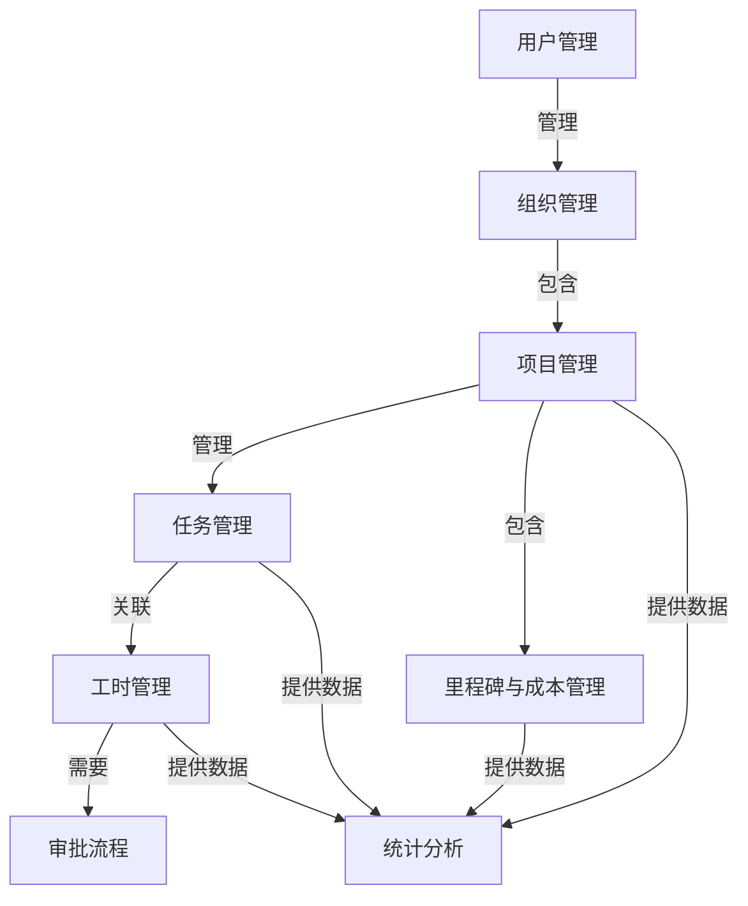

# 工时管理系统 - 模块关系与角色权限说明

## 1. 系统模块关系图

### 模块关系说明
1. **用户管理**：系统的基础模块，负责用户的注册、登录、信息管理等功能，是所有其他模块的基础。
2. **组织管理**：管理企业的组织架构，包含多个项目。
3. **项目管理**：每个组织可以创建多个项目，项目包含任务、里程碑和成本信息。
4. **任务管理**：项目可以分解为多个任务，任务可以分配给项目成员。
5. **工时管理**：员工可以针对任务记录工时，工时记录需要经过审批流程。
6. **审批流程**：负责处理工时记录的审批，确保工时记录的准确性和合法性。
7. **里程碑与成本管理**：管理项目的重要节点和成本信息。
8. **统计分析**：从项目、任务、工时、成本等多个维度进行统计分析，提供数据支持和决策依据。

## 2. 角色与权限矩阵

| 功能模块 | 操作权限 | 系统管理员 | 项目经理 | 部门经理 | 产品经理 | 开发人员 | 测试人员 | 设计师 |
|----------|----------|------------|----------|----------|----------|----------|----------|--------|
| **用户管理** | 用户查询 | ✅ | ❌ | ❌ | ❌ | ❌ | ❌ | ❌ |
| | 用户创建 | ✅ | ❌ | ❌ | ❌ | ❌ | ❌ | ❌ |
| | 用户修改 | ✅ | ❌ | ❌ | ❌ | ❌ | ❌ | ❌ |
| | 用户删除 | ✅ | ❌ | ❌ | ❌ | ❌ | ❌ | ❌ |
| **组织管理** | 组织查询 | ✅ | ❌ | ✅ | ❌ | ❌ | ❌ | ❌ |
| | 组织创建 | ✅ | ❌ | ❌ | ❌ | ❌ | ❌ | ❌ |
| | 组织修改 | ✅ | ❌ | ❌ | ❌ | ❌ | ❌ | ❌ |
| **项目管理** | 项目查询 | ✅ | ✅ | ✅ | ✅ | ✅ | ✅ | ✅ |
| | 项目创建 | ✅ | ✅ | ✅ | ✅ | ❌ | ❌ | ❌ |
| | 项目修改 | ✅ | ✅ | ✅ | ✅ | ❌ | ❌ | ❌ |
| | 项目删除 | ✅ | ✅ | ✅ | ✅ | ❌ | ❌ | ❌ |
| | 项目成员管理 | ✅ | ✅ | ✅ | ✅ | ❌ | ❌ | ❌ |
| **任务管理** | 任务查询 | ✅ | ✅ | ✅ | ✅ | ✅ | ✅ | ✅ |
| | 任务创建 | ✅ | ✅ | ✅ | ✅ | ❌ | ❌ | ❌ |
| | 任务修改 | ✅ | ✅ | ✅ | ✅ | ✅ | ✅ | ✅ |
| | 任务删除 | ✅ | ✅ | ✅ | ✅ | ❌ | ❌ | ❌ |
| | 任务分配 | ✅ | ✅ | ✅ | ✅ | ❌ | ❌ | ❌ |
| **工时管理** | 工时记录 | ✅ | ✅ | ✅ | ✅ | ✅ | ✅ | ✅ |
| | 工时查询 | ✅ | ✅ | ✅ | ✅ | ✅ | ✅ | ✅ |
| | 工时审批 | ✅ | ✅ | ✅ | ❌ | ❌ | ❌ | ❌ |
| | 批量审批 | ✅ | ✅ | ✅ | ❌ | ❌ | ❌ | ❌ |
| **审批流程** | 审批配置 | ✅ | ✅ | ✅ | ❌ | ❌ | ❌ | ❌ |
| | 审批历史查询 | ✅ | ✅ | ✅ | ✅ | ✅ | ✅ | ✅ |
| **里程碑与成本管理** | 里程碑管理 | ✅ | ✅ | ✅ | ✅ | ❌ | ❌ | ❌ |
| | 成本预算管理 | ✅ | ✅ | ✅ | ✅ | ❌ | ❌ | ❌ |
| | 成本跟踪分析 | ✅ | ✅ | ✅ | ✅ | ❌ | ❌ | ❌ |
| **统计分析** | 项目统计 | ✅ | ✅ | ✅ | ✅ | ❌ | ❌ | ❌ |
| | 工时统计 | ✅ | ✅ | ✅ | ✅ | ❌ | ❌ | ❌ |
| | 团队绩效分析 | ✅ | ✅ | ✅ | ✅ | ❌ | ❌ | ❌ |
| | 成本分析 | ✅ | ✅ | ✅ | ✅ | ❌ | ❌ | ❌ |

## 3. 各模块详细功能描述

### 3.1 用户管理
- **用户注册与登录**：支持用户注册、登录、忘记密码等功能
- **用户信息管理**：支持查看和修改用户基本信息、修改密码、上传头像等
- **权限管理**：管理用户角色和权限，实现细粒度的访问控制

### 3.2 组织管理
- **组织架构管理**：管理企业的组织层级结构
- **成员管理**：管理组织成员，分配角色和权限
- **组织统计**：提供组织层面的统计分析

### 3.3 项目管理
- **项目创建与配置**：创建新项目，配置项目基本信息、里程碑和成本
- **项目成员管理**：添加项目成员，配置成员角色和权限
- **项目状态管理**：跟踪和管理项目状态变化
- **项目搜索与筛选**：支持按条件搜索和筛选项目

### 3.4 任务管理
- **任务创建与分配**：创建任务，分配给项目成员，设置优先级和截止日期
- **任务状态管理**：更新任务状态，跟踪任务进度
- **任务依赖管理**：管理任务之间的依赖关系
- **任务搜索与筛选**：支持按条件搜索和筛选任务

### 3.5 工时管理
- **工时记录**：记录工作时间，关联任务和项目，设置工作类型
- **工时查询**：查询个人或团队的工时记录
- **工时审批**：审批员工提交的工时记录
- **批量操作**：支持批量提交和审批工时记录

### 3.6 审批流程
- **审批规则配置**：配置审批流程和规则
- **审批通知**：通过系统消息或邮件发送审批通知
- **审批历史**：查看审批历史记录
- **审批统计**：统计审批效率和状态

### 3.7 里程碑与成本管理
- **里程碑创建与管理**：创建和管理项目里程碑
- **里程碑进度跟踪**：跟踪里程碑完成情况
- **成本预算管理**：设置和管理项目成本预算
- **成本实际跟踪**：记录和跟踪实际成本支出
- **成本分析**：分析成本偏差和趋势

### 3.8 统计分析
- **项目统计**：分析项目进度、成本、风险等
- **工时统计**：统计工时分布、利用率、趋势等
- **团队绩效分析**：分析团队成员绩效、活跃度等
- **成本分析**：分析成本构成、预算执行情况等
- **自定义报表**：支持自定义统计报表和图表

## 4. 角色详细描述

### 4.1 系统管理员
- **职责**：负责系统的整体管理和维护
- **权限范围**：所有功能模块的全部权限
- **核心操作**：用户管理、组织管理、系统配置、权限设置

### 4.2 项目经理
- **职责**：负责项目的整体管理和团队管理
- **权限范围**：项目管理、任务管理、工时审批、统计分析等
- **核心操作**：项目创建、任务分配、工时审批、团队管理

### 4.3 部门经理
- **职责**：负责部门的整体管理和资源调配
- **权限范围**：组织管理、项目管理、统计分析等
- **核心操作**：部门成员管理、项目审批、资源调配、绩效评估

### 4.4 产品经理
- **职责**：负责产品的需求分析和功能规划
- **权限范围**：项目管理、任务管理、需求管理等
- **核心操作**：需求分析、功能规划、任务创建、进度跟踪

### 4.5 开发人员
- **职责**：负责项目的开发工作
- **权限范围**：任务管理、工时记录等
- **核心操作**：任务执行、工时记录、进度更新

### 4.6 测试人员
- **职责**：负责项目的测试工作
- **权限范围**：任务管理、工时记录等
- **核心操作**：测试执行、缺陷报告、工时记录

### 4.7 设计师
- **职责**：负责项目的设计工作
- **权限范围**：任务管理、工时记录等
- **核心操作**：设计执行、工时记录、进度更新

## 5. 权限控制实现机制

### 5.1 基于角色的访问控制 (RBAC)
系统采用RBAC模型实现权限控制，通过角色关联用户和权限，实现灵活的权限管理。

### 5.2 权限层级
1. **功能权限**：控制用户是否可以访问某个功能模块
2. **操作权限**：控制用户是否可以执行某个具体操作
3. **数据权限**：控制用户可以访问的数据范围

### 5.3 权限验证流程
1. 用户登录系统，获取JWT令牌
2. 访问API时，系统验证JWT令牌的有效性
3. 验证用户是否具有访问该API的权限
4. 验证用户是否具有执行该操作的权限
5. 验证用户是否可以访问请求的数据
6. 允许或拒绝请求

## 6. 模块间数据流向

| 数据类型 | 产生模块 | 消费模块 | 数据用途 |
|----------|----------|----------|----------|
| 用户信息 | 用户管理 | 所有模块 | 身份验证、权限控制 |
| 组织信息 | 组织管理 | 项目管理、统计分析 | 项目归属、组织统计 |
| 项目信息 | 项目管理 | 任务管理、工时管理、统计分析 | 任务归属、工时关联、项目统计 |
| 任务信息 | 任务管理 | 工时管理、统计分析 | 工时关联、任务统计 |
| 工时记录 | 工时管理 | 审批流程、统计分析 | 审批处理、工时统计 |
| 审批结果 | 审批流程 | 工时管理、统计分析 | 工时状态更新、审批统计 |
| 里程碑信息 | 里程碑与成本管理 | 项目管理、统计分析 | 项目进度跟踪、里程碑统计 |
| 成本信息 | 里程碑与成本管理 | 项目管理、统计分析 | 成本控制、成本分析 |

## 7. 系统集成关系

### 7.1 内部集成
各模块之间通过API进行内部集成，实现数据共享和功能协同。

### 7.2 外部集成
- **LDAP/AD集成**：支持与企业LDAP或Active Directory集成，实现单点登录
- **邮件系统集成**：支持发送邮件通知和提醒
- **报表系统集成**：支持导出报表到外部系统
- **BI系统集成**：支持与商业智能系统集成，提供更高级的数据分析

## 8. 总结

工时管理系统是一个功能完整、架构清晰的企业级管理平台，通过模块化设计实现了各功能的协同工作。系统采用基于角色的访问控制机制，为不同角色提供了不同的功能权限，确保了系统的安全性和可用性。

各模块之间通过明确的数据流向和调用关系，形成了一个完整的业务闭环：从用户管理到组织管理，再到项目管理、任务管理、工时管理，最后通过审批流程和统计分析，实现了对企业资源和工作流程的全面管理和优化。

通过本系统，企业可以实现对项目、任务、工时、成本的全面管理和控制，提高工作效率，优化资源配置，降低运营成本，提升企业的核心竞争力。